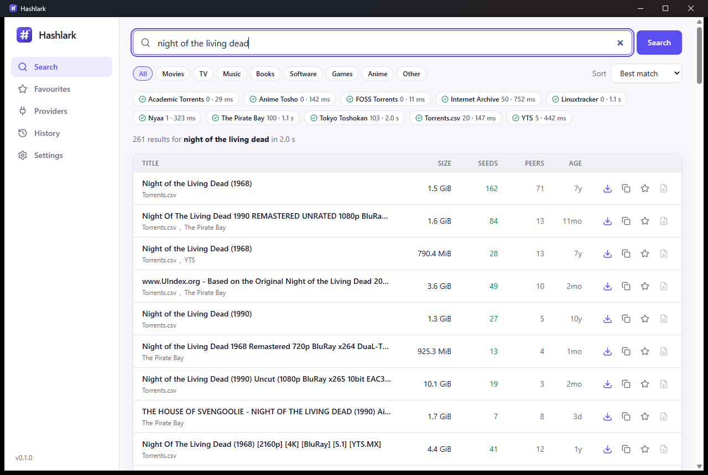
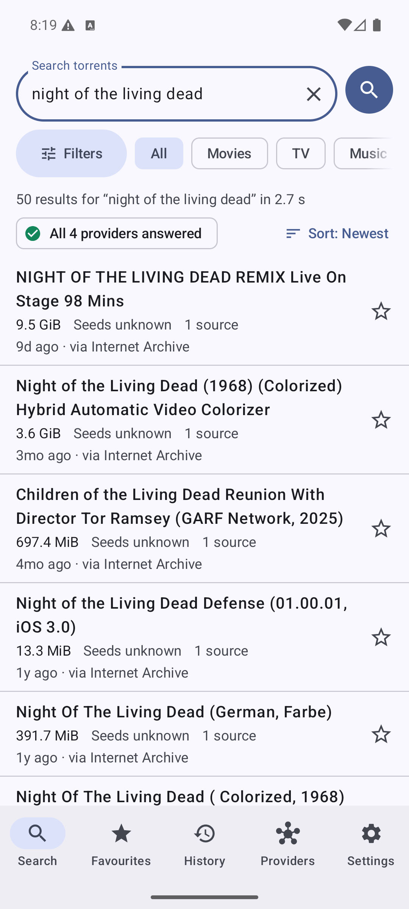
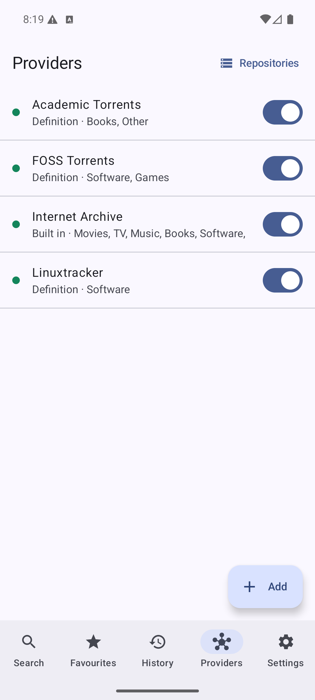

# Hashlark

A fast, private, cross-platform torrent **search** app. Hashlark asks many indexers at once, merges and ranks the results, and hands the magnet link or `.torrent` file to your torrent client.

- **One search, every provider:**
  - results stream in as each site answers;
  - the same torrent found on several sites is shown once;
  - results are ranked by relevance, seeders and age.
- **Add any site without code:**
  - describe a site in a YAML [definition](docs/definition-format.md), write one visually with the built-in editor, or convert Jackett definitions;
  - connect Jackett/Prowlarr through Torznab;
  - subscribe to signed definition repositories that update themselves.
- **Works where sites are blocked:** encrypted DNS (on by default), mirror fallback, proxies, built-in Tor, and a guided flow for browser checks.
- **Keeps itself healthy:** failing providers are paused and retried automatically, and a nightly canary checks the built-in definitions.
- **Desktop app** for Windows, macOS and Linux, an **Android app** that adapts to phones, tablets and foldables (built for the Galaxy Z Fold7), and a **headless server** with a web UI, API keys, Docker image and a Torznab endpoint for Sonarr/Radarr.
- **Private by design:** no telemetry. Credentials are kept in the OS keychain. Hashlark ships with legal sources only.

## Screenshots

Desktop app: one search across 12 providers, with duplicates merged.



Android app (release build):

<p>
  
  &nbsp;
  
</p>

## Documentation

| | |
|---|---|
| [User guide](docs/user-guide.md) | Installing and using the app |
| [Definition format](docs/definition-format.md) | Adding a site in YAML |
| [Running the server](docs/deploy/README.md) | Docker, systemd, TLS, Sonarr/Radarr |
| [Android app](apps/android/README.md) and [plan](docs/android-plan.md) | Building, layouts for foldables, distribution |
| [Releasing](docs/releasing.md) | Signing keys and cutting a release |
| [Plan](docs/PLAN.md) and [decisions](docs/adr/) | Design and architecture |

## Repository layout

```
crates/
  hashlark-core/     engine: providers, aggregation, definitions, network (DoH/proxy/Tor), storage
  hashlark-server/   HTTP API (REST + SSE + Torznab), web UI hosting, headless server binary
  hashlark-cli/      command line: search, definitions tooling, repositories
  hashlark-ffi/      UniFFI bindings of the core for the Android app
  uniffi-bindgen/    generates the Kotlin bindings
apps/desktop/        Tauri 2 shell + Svelte 5 UI (the same UI is served by the headless server)
apps/android/        Kotlin + Jetpack Compose app (modules: app, core, ffi)
definitions/         first-party definitions (legal sources) and the definition JSON Schema
fixtures/            recorded pages used by offline tests
docs/                plan, decisions, guides
```

## Building

Requirements: Rust stable, Node 24 with pnpm 9, and the platform prerequisites for Tauri (MSVC build tools and WebView2 on Windows).

```bash
cargo test --workspace --exclude hashlark-desktop   # engine, server, CLI
cd apps/desktop && pnpm install && pnpm check && pnpm test
pnpm tauri dev                                      # run the desktop app
pnpm tauri build                                    # installers in target/release/bundle
```

Command line:

```bash
cargo run -p hashlark-cli -- search night of the living dead --category movies
cargo run -p hashlark-cli -- defs new my-site --type html      # write a definition
cargo run -p hashlark-cli -- defs test my-site.yml --live
```

Headless server (serves the web UI when `apps/desktop` has been built):

```bash
cargo run -p hashlark-server -- --bind 127.0.0.1:8787   # prints the first API key
```

## Legal

Hashlark is a neutral search tool. It hosts no content, and it ships with legal sources only (the Internet Archive, Linux distributions, academic datasets and open-source software). You are responsible for complying with the law and copyright where you live.

## Licence

[GPL-3.0-or-later](LICENSE).
